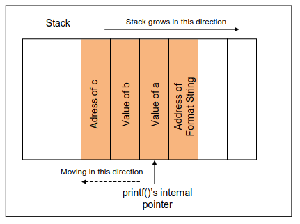
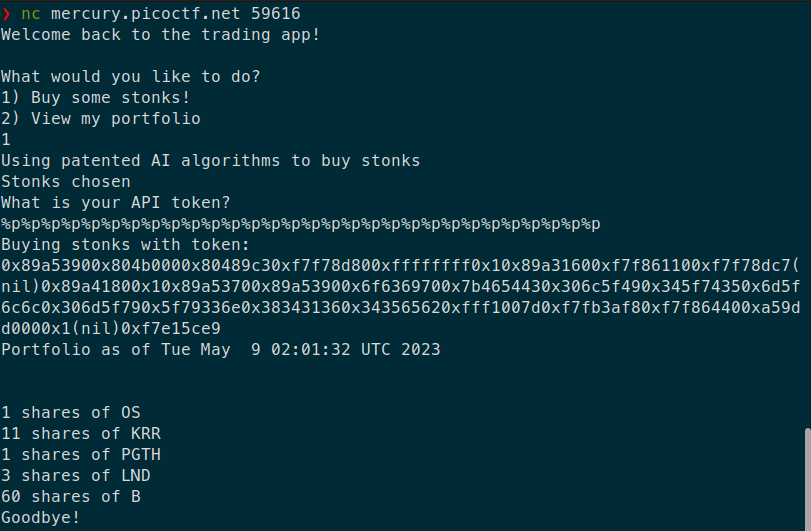

# Stonks

## Overview

**Points**: 20

**Category**: [Binary Exploitation](../)

## Description

I decided to try something noone else has before. I made a bot to automatically trade stonks for me using AI and machine learning. I wouldn't believe you if you told me it's unsecure! [vuln.c](./vuln.c) `nc mercury.picoctf.net 59616`

## Hints

1. Okay, maybe I'd believe you if you find my API key.

## Solution

Analyzing the C code, notice that the program asks the user to enter the API token. It then prints the output directly using `printf`. However, there is no sanitization done with the percent signs, i.e. `printf("%s", user_buf)`. We can take advantage of this and exploit it.

> You can learn more about string formatting attacks at [Syracuse University Lecture Notes](https://web.ecs.syr.edu/~wedu/Teaching/cis643/LectureNotes_New/Format_String.pdf) and [OWASP](https://owasp.org/www-community/attacks/Format_string_attack).

Recall that C stores all its variables in a stack and each new variable is added to the end of the stack.

Since no santization is done, we can use different string formats (`%s`, `%d`, `%p`, etc.) to print out different variables or pointers. After trying different symbols, notice that `%p` gives an output that seems something like hex. Putting around 30 `%p` gives the string `0x987f3f00x804b0000x80489c30xf7f2ed800xffffffff0x10x987d1600xf7f3c1100xf7f2edc7(nil)0x987e1800x10x987f3d00x987f3f00x6f6369700x7b4654430x306c5f490x345f74350x6d5f6c6c0x306d5f790x5f79336e0x383431360x343565620xffc5007d0xf7f69af80xf7f3c4400x7811d000x1(nil)0xf7dcbce9`, which seems to be a mixture of hex and ascii.

We can use [CyberChef](https://gchq.github.io/CyberChef/) to decrypt the hex code. Use the `From Hex` tool to convert from hex to ascii. 

Notice how we get a flag, but it seems like each 4 letter block is reversed (`ocip` instead of `pico`). This is probably a case of endianness, so we can add the `Swap Endinanness` tool, and the flag should appear. If the flag is still scrambled, then delete characters from the beginning of the input string until you see the flag.

## Flag

`picoCTF{I_l05t_4ll_my_m0n3y_6148be54}`
