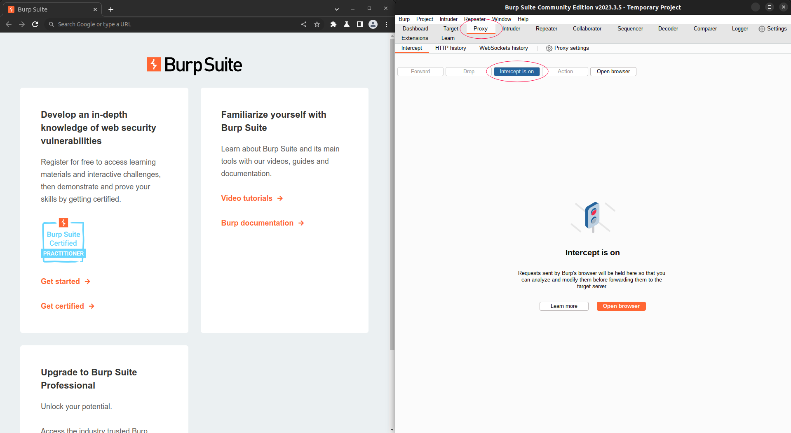
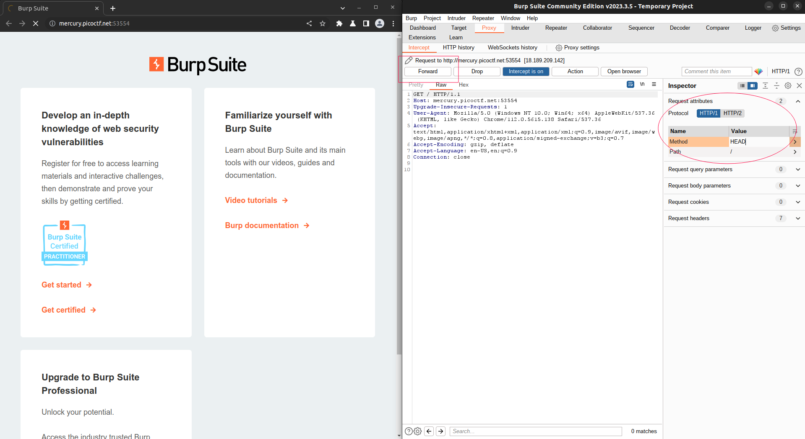
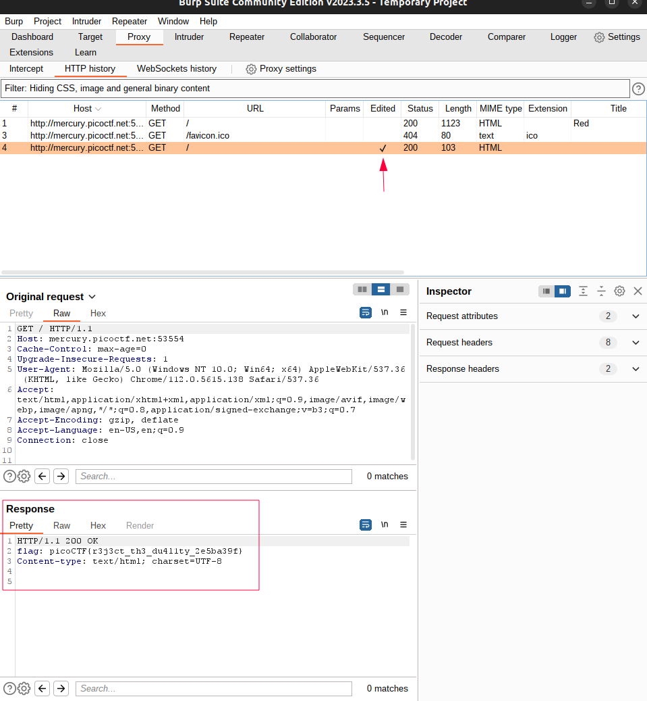

# GET aHEAD

## Overview

**Points**: 20

**Category**: [Web Exploitation](../)

## Description

Find the flag being held on this server to get ahead of the competition [http://mercury.picoctf.net:53554/](http://mercury.picoctf.net:53554/)

## Hints

1. Maybe you have more than 2 choices
2. Check out tools like Burpsuite to modify your requests and look at the responses

## Solution

After opening the website, open developer tools and click on the network tab, and click the "Choose Red" and "Choose Blue" buttons. Notice that the former sends a GET request, while the latter sends a POST request. 

After doing some more investigation, we realize that there are multiple types of requests, as shown in this page: https://developer.mozilla.org/en-US/docs/Web/HTTP/Methods. The title of the challenge seems to suggest that we need to send a HEAD request.

Download and run Burpsuite. Switch to the proxy tab at the top, turn intercept on, and open the browser on the side. Now, you can analyze any request that comes through. 

Copy and paste the website link into the browser, and you'll notice that the website is intercepted and its Header contents are displayed. Click on "Request Attributes" on the right, and change the Method to HEAD. Then, click forward to display the website.

At this point, you should see an empty page, since a HEAD request only loads the headers and not the body content. If you do see the webpage, reload and try the previous step again. 

Now click on HTTP history, and click on the page with edited checked. This means that the request was sent with an edited header. Scroll down to the response, and you should be able to see the flag.

## Flag

*Note that the flag might be different for you, so follow the steps in the solution to get the flag*

picoCTF{r3j3ct_th3_du4l1ty_2e5ba39f}
